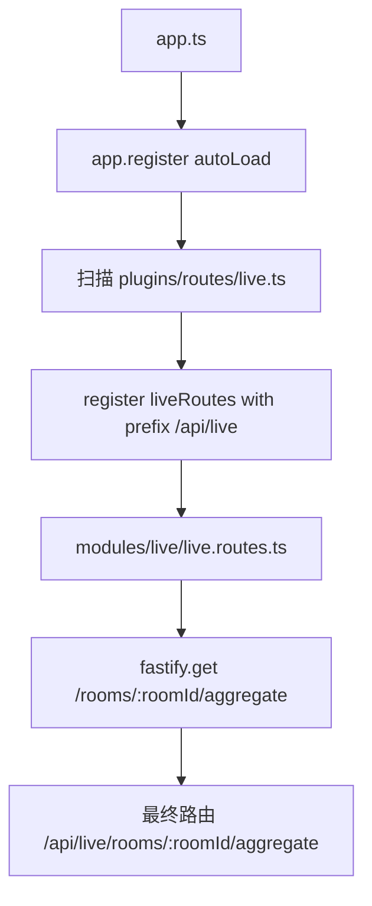

# fastify-demo

一个聚焦学习的 `Fastify + TypeScript` 最小 BFF 模板。

## 项目定位

这个项目不是为了堆很多演示接口，而是为了先搭一套最小可用的 BFF 工程骨架。

当前重点是看懂：

- Fastify 应用怎么启动和组装
- core plugins 怎么注册平台能力
- 一个模块怎么走 `schema -> controller -> service`
- 聚合接口怎么做部分失败降级

## 快速开始

1. 复制环境变量模板：

```powershell
Copy-Item .env.example .env
```

2. 安装依赖：

```bash
pnpm install
```

3. 启动开发服务：

```bash
pnpm dev
```

## 常用脚本

- `pnpm dev`：开发模式启动服务
- `pnpm build`：编译 TypeScript 到 `dist`
- `pnpm start`：先构建再启动
- `pnpm check`：顺序执行 `typecheck`、`lint`、`test`
- `pnpm format`：按当前 Prettier 规则格式化仓库
- `pnpm format:check`：检查格式是否符合 Prettier

## 当前接口

- `GET /health`
- `GET /readiness`
- `GET /metrics`
- `GET /api/live/rooms/:roomId/aggregate`
- `GET /docs`

## 如何注册路由

这个项目的路由注册分两层：

1. `app.ts` 里通过 `@fastify/autoload` 自动加载 `plugins/routes/`
2. `plugins/routes/*.ts` 再把具体业务模块挂到对应前缀下

当前入口代码可以理解成：

```ts
app.register(autoLoad, {
    dir: join(__dirname, 'plugins', 'routes'),
    dirNameRoutePrefix: false,
});
```

它的意思是：

- 扫描 `plugins/routes/` 目录
- 发现里面的 Fastify 插件文件后自动注册
- 不使用目录名自动生成路由前缀

### 当前项目是怎么接进去的

以直播模块为例：

```text
app.ts
  -> plugins/routes/live.ts
     -> modules/live/live.routes.ts
```

更直观一点，可以理解成下面这张图：



对应关系是：

- `plugins/routes/live.ts`：模块入口插件，负责给直播模块挂统一前缀 `/api/live`
- `modules/live/live.routes.ts`：真正定义接口 URL、schema 和 handler

所以最终接口：

```text
GET /api/live/rooms/:roomId/aggregate
```

是这样来的：

- `plugins/routes/live.ts` 先注册模块前缀 `/api/live`
- `modules/live/live.routes.ts` 再定义 `/rooms/:roomId/aggregate`
- 两者拼起来就是 `/api/live/rooms/:roomId/aggregate`

### 如果后面要新增一个路由模块

假设你以后要新增 `live-room` 模块，推荐按下面步骤做：

1. 新建模块目录：

```text
modules/live-room/
  live-room.routes.ts
  live-room.schema.ts
  live-room.controller.ts
  live-room.service.ts
  live-room.types.ts
```

2. 在 `plugins/routes/` 下新增入口文件：

```ts
import type { FastifyPluginAsync } from 'fastify';
import liveRoomRoutes from '../../modules/live-room/live-room.routes';

const liveRoomPlugin: FastifyPluginAsync = async (fastify) => {
    await fastify.register(liveRoomRoutes, { prefix: '/api/live-room' });
};

export default liveRoomPlugin;
```

3. 在 `modules/live-room/live-room.routes.ts` 里定义具体接口：

```ts
import type { FastifyInstance } from 'fastify';

async function liveRoomRoutes(fastify: FastifyInstance): Promise<void> {
    fastify.get('/init', async () => {
        return { ok: true };
    });
}

export default liveRoomRoutes;
```

这样启动后就会得到：

```text
GET /api/live-room/init
```

### 为什么这样设计

- `app.ts` 不需要随着业务模块增加而不断手写 `app.register(...)`
- 每个业务模块都有自己的入口文件，前缀更清晰
- 模块内部继续保持 `routes -> schema -> controller -> service` 分层
- 后续新增模块时，只需要在 `plugins/routes/` 里加一个入口插件即可

## 目录摘要

- `config/`：环境变量读取、校验和配置整理
- `errors/`：统一错误类和错误码
- `lib/`：缓存、HTTP client、metrics 等基础能力
- `plugins/core/`：平台能力插件
- `plugins/routes/`：平台路由和业务模块入口
- `modules/live/`：唯一保留的业务演示模块
- `types/`：Fastify 类型扩展

## 文档入口

- [LEARNING_MAP.md](docs/LEARNING_MAP.md)：怎么读这套代码
- [demo.md](docs/demo.md)：项目定位和演示价值
- [迁移说明.md](docs/%E8%BF%81%E7%A7%BB%E8%AF%B4%E6%98%8E.md)：哪些内容适合迁移到真实项目
- [BFF约束清单.md](docs/BFF%E7%BA%A6%E6%9D%9F%E6%B8%85%E5%8D%95.md)：当前状态和 TODO

## 环境变量

常见项：

- `NODE_ENV`
- `HOST`
- `PORT`
- `LOG_LEVEL`
- `REQUEST_ID_HEADER`
- `CORS_ALLOWED_ORIGINS`
- `SWAGGER_ENABLED`
- `SWAGGER_ROUTE_PREFIX`
- `UPSTREAM_TIMEOUT_MS`

完整说明请看：

- [.env.example](.env.example)
- [index.ts](config/index.ts)

## 一句话总结

```text
这是一个用于学习和沉淀 BFF 工程骨架的最小 Fastify 模板。
```
